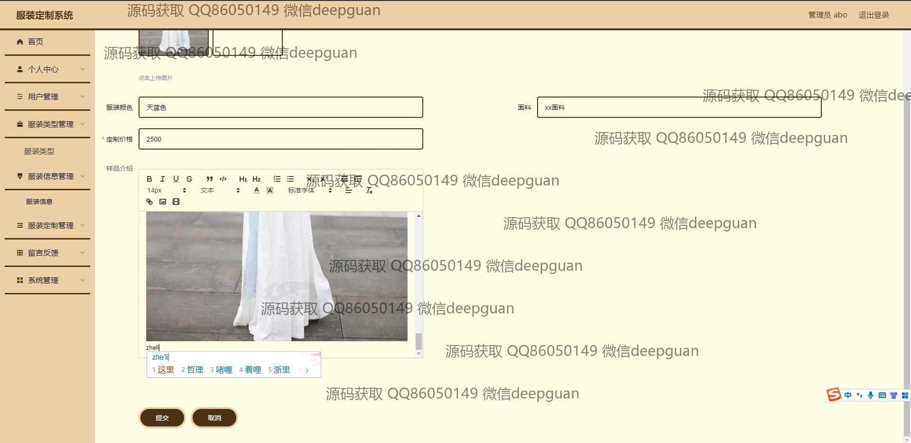

<h1 align="center">服装定制系统</h1>

## 简介
服装定制系统：角色分为管理员、用户；功能包括用户管理、服装信息录入、订单管理、留言反馈、系统管理等，支持个性化服装定制和信息管理，界面设计简洁明了，操作便捷。    --计算机毕业设计源码；毕设源码；java毕业设计源码

## 联系方式

<h3 align="center">获取完整代码与数据库文件 + 微信：deepguan QQ: 86050149 QQ群: 783742310</h3>

<h3 align="center">可帮忙远程部署 包运行成功！提供远程部署、修改代码、设计文档指导、代码讲解等服务！</h3>

## 功能介绍（完整见运行截图）
管理员：基本功能包括用户登录、注册及安全退出。系统首页设有功能导航栏，包含个人中心、服装类型管理、服装信息管理、服装定制管理、留言反馈和系统管理等。用户管理模块允许管理员查看及修改用户信息，并处理用户反馈。服装信息管理功能涉及输入与编辑服装名称、类型、面料、颜色及定制价格等详细信息，支持上传图片和文本描述。

用户：基本功能涵盖注册和登录，以便访问系统首页及其功能模块。用户可浏览服装资讯、查看和使用各种服装过滤选项、上传图片及参与服装定制。个人中心允许用户修改个人信息与密码，并进行订单查询与管理。此外，用户能通过留言反馈模块与系统进行互动，提交意见及查看回复，提升服装定制体验。

## 运行截图

本代码来源于网络,仅供学习参考使用!

